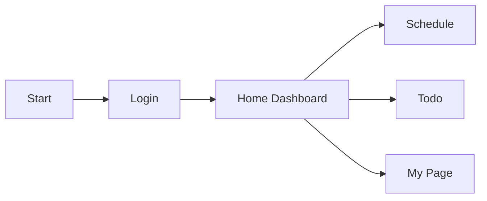
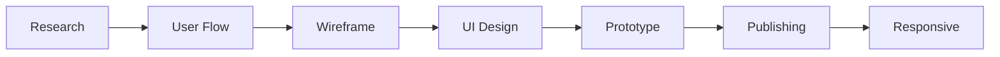
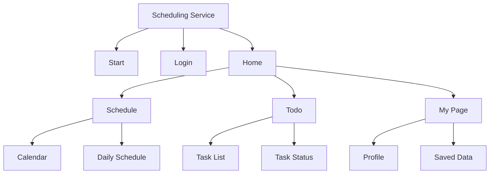
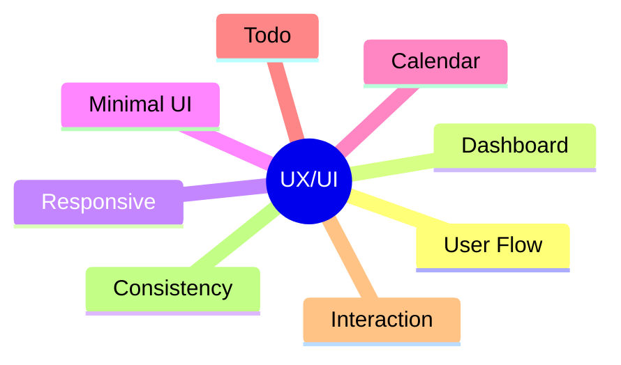
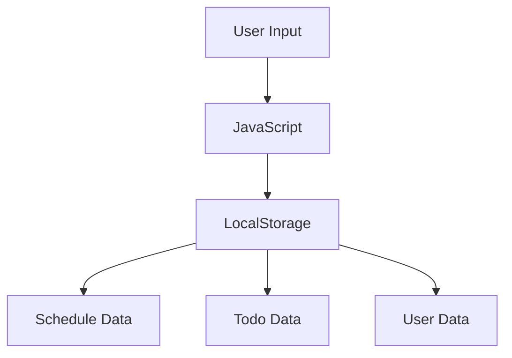
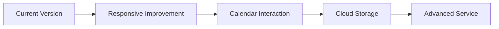

# Scheduling Service

사용자의 일정과 할 일을 보다 직관적으로 관리할 수 있도록 설계한  
스케줄링 서비스 UI/UX 프로젝트입니다.

> 일정 확인, 할 일 관리, 저장 기능을 통해  
> 사용자 중심의 일정 관리 흐름을 구현했습니다.

---

## Project Overview

| Category   | Content                         |
| ---------- | ------------------------------- |
| Project    | Scheduling Service              |
| Type       | UI/UX · Web Design · Publishing |
| Tech       | HTML · CSS · JavaScript         |
| Responsive | Desktop · Mobile                |
| Storage    | LocalStorage                    |
| Deploy     | GitHub Pages                    |

---

## Core Features

| Feature        | Description                |
| -------------- | -------------------------- |
| Onboarding     | 서비스 소개 및 시작 화면   |
| Login          | 로그인 및 회원가입 흐름    |
| Dashboard      | 일정 및 할 일 요약         |
| Schedule       | 일정 관리 기능             |
| Todo           | 할 일 추가 및 상태 관리    |
| My Page        | 사용자 정보 및 저장 데이터 |
| Responsive Web | 반응형 UI 구현             |

---

# User Flow



---

# Design Process



---

# Information Architecture



---

# UX/UI Keywords



---

# Tech Stack

## Frontend


---

## Tools


---

# Main Pages

| Page     | Description                |
| -------- | -------------------------- |
| Start    | 서비스 시작 화면           |
| Login    | 로그인 및 회원가입         |
| Home     | 일정 및 할 일 요약         |
| Schedule | 일정 관리 화면             |
| Todo     | 할 일 관리 화면            |
| My Page  | 사용자 정보 및 저장 데이터 |

---

# State Flow



---

# Folder Structure

```text
scheduling-service/
├── assets
├── css
├── js
├── index.html
├── home.html
├── schedule.html
├── todo.html
├── my.html
└── README.md
```

---

# Implementation Points

| Category    | Description                          |
| ----------- | ------------------------------------ |
| UI/UX       | 사용자 흐름 기반 일정 관리 구조 설계 |
| Web Design  | 대시보드 기반 UI 구성                |
| Publishing  | HTML/CSS 기반 반응형 구현            |
| Interaction | JavaScript 기반 인터랙션 구현        |
| Storage     | LocalStorage 기반 데이터 관리        |

---

# Future Improvements



---

# What I Learned

- 사용자 흐름 기반 화면 설계 경험
- 일정 관리 서비스 구조 설계 경험
- 반응형 웹 구현 경험
- LocalStorage 기반 상태 관리 경험
- 디자인과 퍼블리싱 연결 과정 이해

---

# Links

- GitHub  
  https://github.com/appleking7523-source/scheduling-service

- Notion  
  https://decisive-colt-c78.notion.site/32ca9342f6a68078a0aafbba7632f2c8
